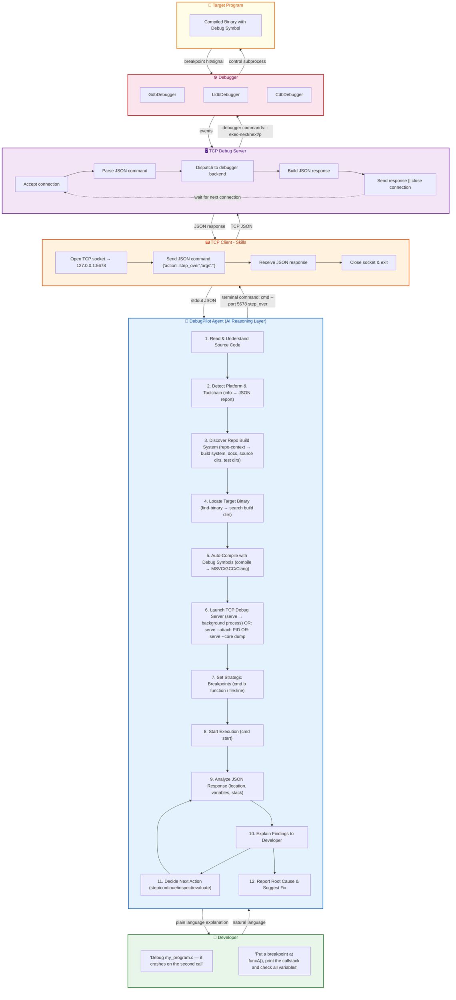

# DebugPilot: Architecture Diagrams

These diagrams illustrate how the **DebugPilot** AI agent drives real debuggers (GDB, LLDB, CDB) to find bugs end-to-end.

---

## 1. End-to-End Architecture

Shows all 6 layers: Developer → DebugPilot Agent → TCP Client → TCP Server → Debugger Backend → Target Program.

---

## Key Design Decisions

| Decision | Rationale |
|---|---|
| **TCP server/client split** | Copilot agents can only run terminal commands — TCP lets a stateless CLI control a persistent debugger subprocess |
| **One connection per command** | Simple, no state leaks, easy error recovery — if a command fails the next one still works |
| **Polymorphic backends** | `GdbDebugger`, `LldbDebugger`, `CdbDebugger` share the same `cmd_*()` interface — the server doesn't know which is running |
| **Unified JSON schema** | Every command returns the same fields (`status`, `current_location`, `call_stack`, `local_variables`) regardless of backend |
| **Auto-compile** | Developer hands a `.c` file to the agent — the system compiles with debug symbols automatically before launching the debugger |
| **Platform auto-detection** | `ToolchainInfo` searches PATH, Visual Studio directories, Windows SDK, and xcrun to find the best tools for the current OS |
| **CDB preferred on Windows** | CDB natively reads PDB symbols from MSVC — no format mismatch, works with the same debug engine as Visual Studio and WinDbg |
| **Repo discovery** | `build-info`, `find-binary`, `repo-context` let the agent understand unfamiliar projects — detect build system, locate binaries, find docs |
| **Attach mode** | `--attach PID` enables debugging running processes — essential for deadlocks, hangs, and production issues |
| **Core dump mode** | `--core PATH` enables post-mortem crash analysis — no need to reproduce the bug |
| **Auto source path mapping** | Server auto-detects repo root via `.git` and adds it as a source path — source-level debugging works even for out-of-tree builds |
