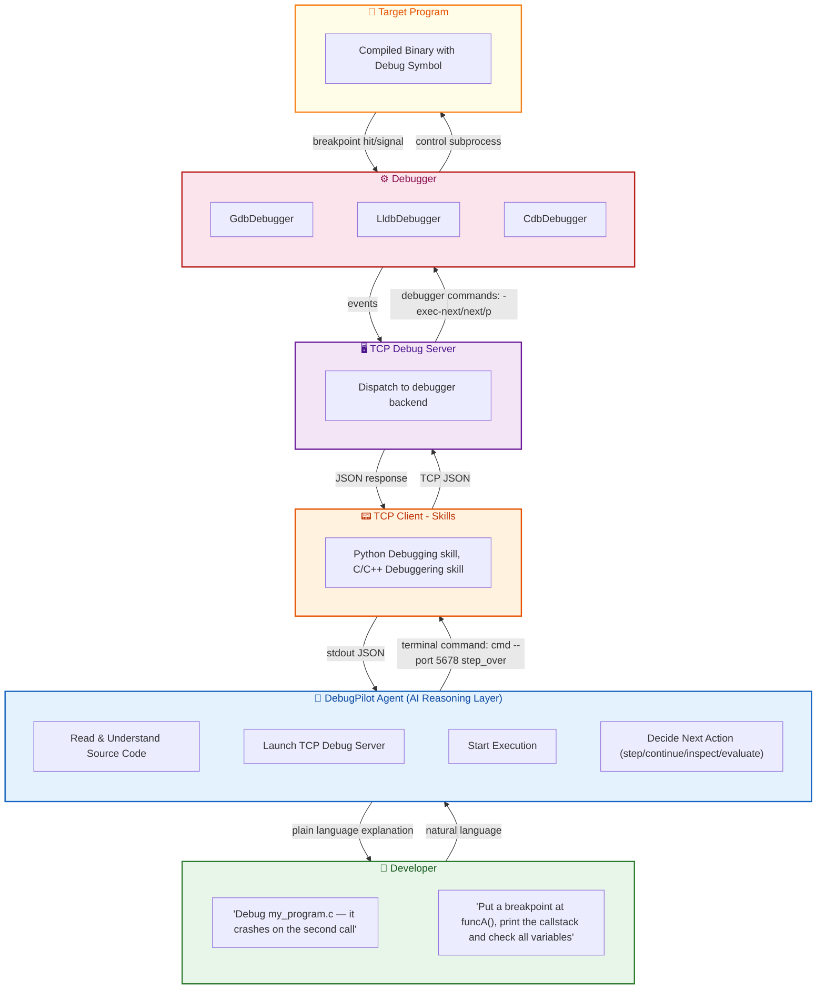

# DebugPilot: Architecture Diagrams - simplified

```mermaid
%%{ init: { 'flowchart': { 'nodeSpacing': 70, 'rankSpacing': 70 } } }%%
flowchart TB
    subgraph DEV["👤 Developer"]
        D1["'Debug my_program.c — it crashes on the second call'"]
        D2["'Put a breakpoint at funcA(), print the callstack and check all variables'"]
        D1 ~~~ D2
    end

    subgraph PILOT["🤖 DebugPilot Agent (AI Reasoning Layer)"]
        direction TB
        P1["Read & Understand Source Code"]
        P2["Launch TCP Debug Server"]
        P3["Start Execution"]
        P4["Decide Next Action (step/continue/inspect/evaluate)"]
    end

    subgraph CLIENT["📟 TCP Client - Skills"]
        C1["Python Debugging skill, C/C++ Debuggering skill"]
    end

    subgraph SERVER["🖥️ TCP Debug Server"]
        S1["Dispatch to debugger backend"]
    end

    subgraph BACKEND["⚙️ Debugger"]
        direction TB
        B1["GdbDebugger"]
        B2["LldbDebugger"]
        B3["CdbDebugger"]
    end

    subgraph TARGET["🎯 Target Program"]
        T1["Compiled Binary with Debug Symbol"]
    end

    DEV -->|"natural language"| PILOT
    PILOT -->|"terminal command: cmd --port 5678 step_over"| CLIENT
    CLIENT -->|"TCP JSON"| SERVER
    SERVER -->|"debugger commands: -exec-next/next/p"| BACKEND
    BACKEND -->|"control subprocess"| TARGET
    TARGET -->|"breakpoint hit/signal"| BACKEND
    BACKEND -->|"events"| SERVER
    SERVER -->|"JSON response"| CLIENT
    CLIENT -->|"stdout JSON"| PILOT
    PILOT -->|"plain language explanation"| DEV

    style DEV fill:#E8F5E9,stroke:#2E7D32,stroke-width:2px,color:#1B5E20
    style PILOT fill:#E3F2FD,stroke:#1565C0,stroke-width:2px,color:#0D47A1
    style CLIENT fill:#FFF3E0,stroke:#E65100,stroke-width:2px,color:#BF360C
    style SERVER fill:#F3E5F5,stroke:#6A1B9A,stroke-width:2px,color:#4A148C
    style BACKEND fill:#FCE4EC,stroke:#B71C1C,stroke-width:2px,color:#880E4F
    style TARGET fill:#FFFDE7,stroke:#F57F17,stroke-width:2px,color:#E65100
```
